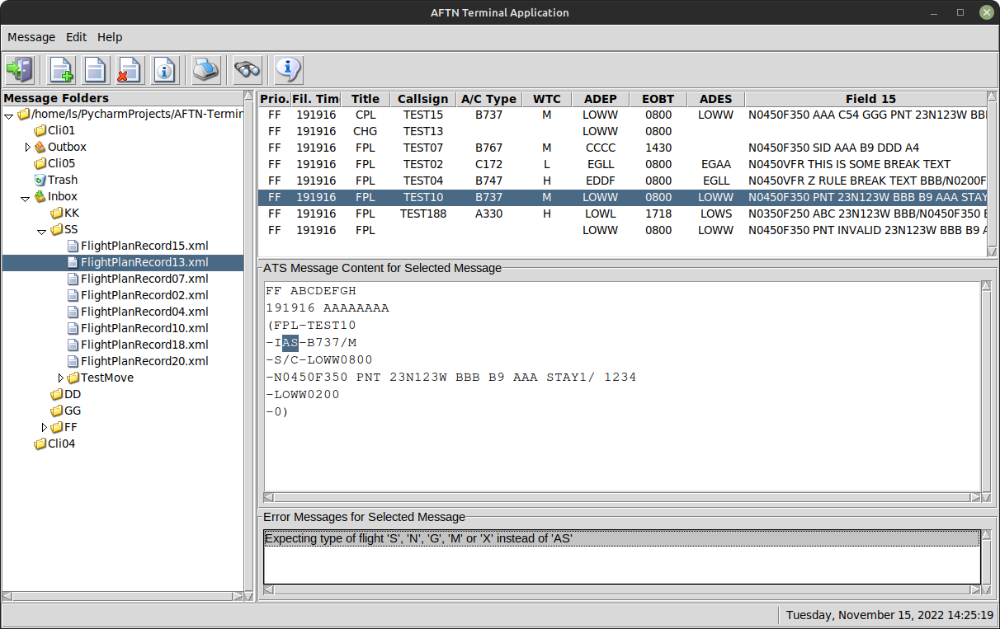
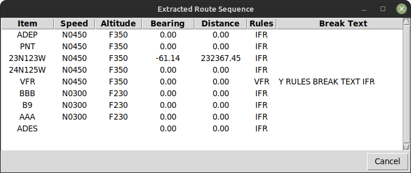
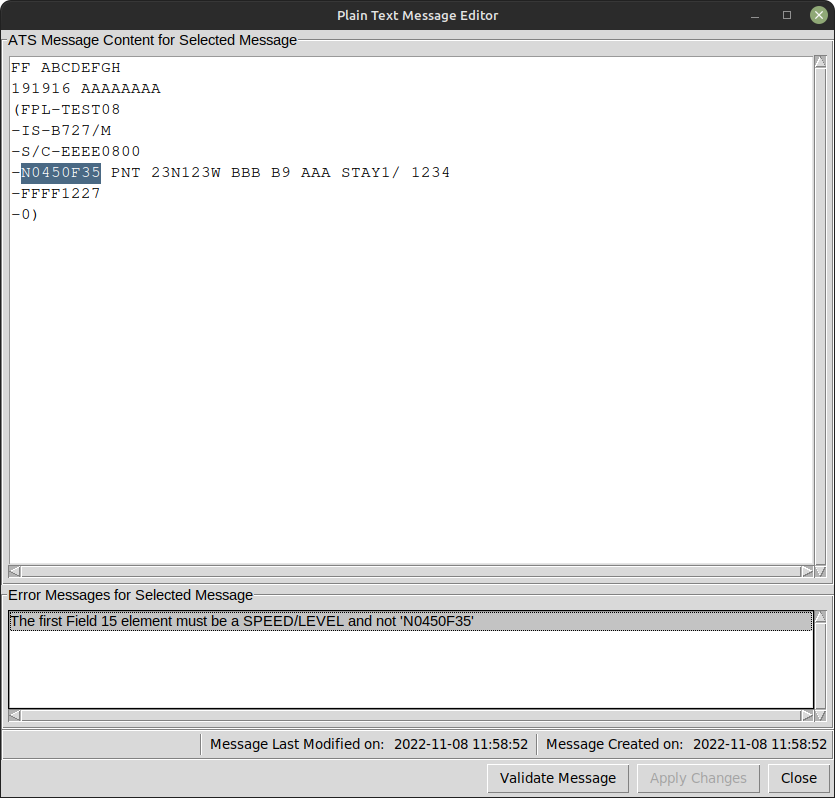
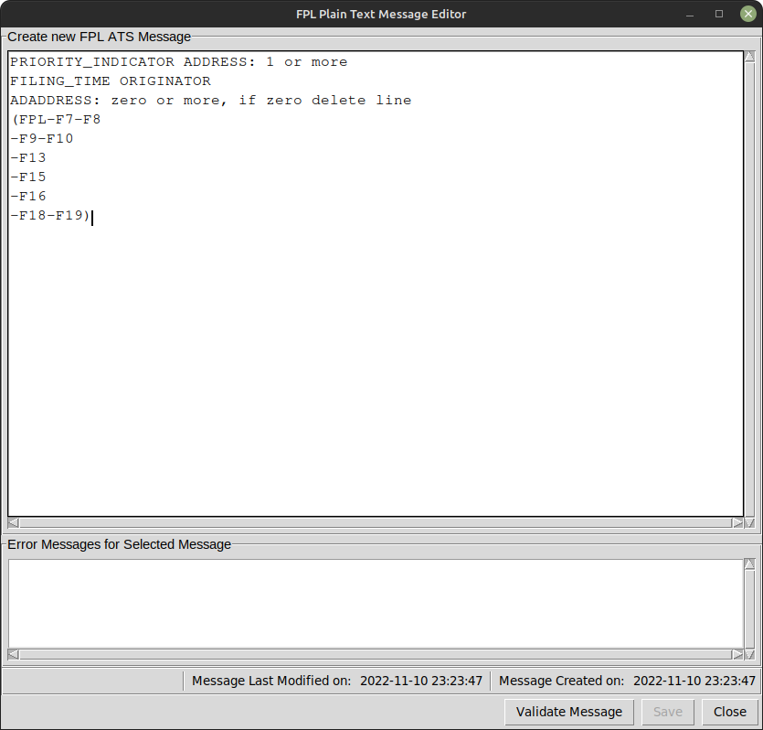

# AFTN Terminal Application

This <a href="https://github.com/">GitHub</a> repository contains an <b>AFTN Terminal Application</b>; this application is a standalone client that runs as a GUI application. The application is cross-platform compatible running on both Linux, Mac OSX and Windows platforms.

The <b>AFTN Terminal Application</b> is implemented using Python version 3.10.7. A more recent version of Python must be used in order to support <b>switch</b> (Python <b>match</b>) statements used in the source code.
The GUI has been written using the Tkinter library.

An acronym list is provided at the end of this readme for readers unfamiliar with ATC acronyms.

The <b>AFTN Terminal Application</b> uses a standalone <b>ICAO ATS and OLDI Message Parser</b> and <b>ICAO Field 15 Parser</b> that are both available as open source <a href="https://github.com/">GitHub</a> projects that can be found <a href="https://github.com/pventon/ICAO-ATS-and-OLDI-Message-Parser">here for the ICAO Message Parser</a> and <a href="https://github.com/pventon/ICAO-F15-Parser">here for the F15 Parser</a>.

All software for the <b>AFTN Terminal Application</b>, <b>ICAO ATS and OLDI Message Parser</b> and <b>ICAO Field 15 Parser</b> <a href="https://github.com/">GitHub</a> repositories have been written by Peter Venton (user <a href="https://github.com/pventon">pventon</a> on <a href="https://github.com/">GitHub</a>).

The project has been built using the <a href="https://www.jetbrains.com/pycharm/">PyCharm 2022.2.2</a> (Professional Edition) IDE running on a <a href="https://www.linuxmint.com">Linux Mint</a> OS. Installing Python 3.x and the <a href="https://www.jetbrains.com/pycharm/">PyCharm IDE</a> was straightforward with everything working as expected. Please donate and support <a href="https://www.linuxmint.com">Linux Mint</a> if your able to do so, its a great OS!

All development has been carried out on a Linux Mint platform and has <b><i>NOT</i></b> been tested on either Windows or Mac OSX platforms. The software has been written with cross-platform support in mind.

<h1>Overview</h1>

The <b>AFTN Terminal Application</b> processes ICAO ATS messages. The application is structured similar to an email client with a message tree in a left pane for organising messages, a list of messages when a message folder is selected in the tree pane and a message display area that contains the content of a selected message along with any associated error messages.

Errors can be double-clicked to highlight erroneous fields in a message making it easy to locate and fix message errors. If multiple errors are detected, all erroneous fields can be simultaneously highlighted.

The Extracted Route Sequence for a flight can be displayed in a dedicated window as shown below.

A message editor is provided to edit received messages and / or creating new messages.

 A simple message template is provided when creating and editing new messages.
All ICAO defined ATS messages are supported and templates for all supported messages are provided.

<h2>Current Functionality</h2>

More documentation will follow shortly; this is an initial release and documentation will follow soon.

<h2>Current Limitations</h2>

15th November 2022 - The source code is now fully documented;

15th November 2022 - The Toolbar buttons have been added with supported functionality apart from the print and search buttons.

15th November 2022 - Currently, the AFTN interface and associated protocol handler have not yet been implemented; this will be provided in a future release.

<h2>Future Upgrades</h2>

The following have yet to be provided:

<ul>
<li>A TCP/IP protocol handler has to be provided that complies with ICAO Annex 10, Vol II in order to provide an AFTN network interface for the application;</li>
<li>Full documentation has to be provided, this includes a User Manual</li>
</ul>
<h2>Errata and Faults</h2>

Although every attempt has been made to reduce the number of software coding errors and resulting chaos that can ensue as a result of such errors, it is highly likely that this early release will have a few bugs. Substantial testing has been carried out on the GUI, but even with so many tests, there may still be some bugs in the software.

Should any use be made of this software and errors found, do not hesitate to contact me at peter.venton@flightatm.com, so I may attempt to fix/correct any issues, or alternatively post any errors on the discussion page or bug tracker that I believe is supplied as part of GitHub.

<b>Enjoy and Good Luck!</b>
<h1>AFTN Terminal Application Usage</h1>

There is a file called <b><i>RunAftnTerminal</i></b> in the project root directory that is the application entry point.

In this file there is a working directory path specified that must be set to a local directory; this directory will be used to store all messages processed by the application. Do not put other files in the working directory or any of its subdirectories.

Each message is stored as an XML file and these files are placed in the working directory and its subdirectories.

The project was written using the PyCharm IDE; a 'test' working directory is provided as part of the <a href="https://github.com/">GitHub</a> repository in the directory shown in the usage code example shown below. This directory contains a number of ATS messages that can be used to evaluate the application functionality.

<pre><code>
# The following is the content of the RunAftnTerminal...
from AFTN_Terminal.ApplicationMainWindow import ApplicationMainWindow
#
# Set the working directory as shown to a local directory
# The application creates subdirectories in this directory that are displayed in the tree
# displayed in the application.
aftn = ApplicationMainWindow("/home/ls/PycharmProjects/AFTN-Terminal-Application/AFTN-App-Working-Directory")
#
# Run the application, this will display the GUI
aftn.start_application()
</code></pre>

<h1>Acronyms</h1>
<ul>
<li>ABI     OLDI Advanced Boundary Information</li>
<li>ACH     ATS ATC Change Message</li>
<li>ACT     OLDI Activation Message</li>
<li>ACP     ATS Advanced Coordination Procedure Message</li>
<li>ACP     OLDI Advanced Coordination Procedure Message</li>
<li>ADEP    Aerodrome of Departure (Given as an ICAO Location Indicator)</li>
<li>ADES    Aerodrome of Destination (Given as an ICAO Location Indicator)</li>
<li>AFP     ATS ATC Flightplan Proposal Message</li>
<li>AIP     Aeronautical Information Publication</li>
<li>ALR     ATS ATC Alerting Message</li>
<li>AMA     OLDI Arrival Management Message</li>
<li>APL     ATS ATC Flight Plan Message</li>
<li>ARR     ATS Arrival Message</li>
<li>ATC     Air Traffic Control</li>
<li>ATS     Air Traffic Service</li>
<li>CDN     ATS Change Message</li>
<li>CDN     OLDI Coordination Message</li>
<li>CFMU    Central Flow Management Unit</li>
<li>CNL     ATS Cancel Message</li>
<li>COD     OLDI Advanced Coordination Procedure</li>
<li>CPL     OLDI Current Flight Plan Message</li>
<li>CPL     ATS Current Flight Plan Message</li>
<li>DCT     Direct (used to specify direct routing between points)</li>
<li>DEP     ATS Departure Message</li>
<li>DLA     ATS Delay Message</li>
<li>ERS     Extracted Route Sequence</li>
<li>EST     ATS Estimate Message</li>
<li>ETO     Estimated Time Over</li>
<li>FPL     ATS Flight Plan Message</li>
<li>FPR     Flight Plan Record</li>
<li>FNM     Gander Oceanic Message</li>
<li>GAT     General Air Traffic</li>
<li>GUI     Graphical User Interface</li>
<li>ICAO    International Civil Aviation Organisation</li>
<li>IFR     Instrument Flight Rules</li>
<li>IFPS    Initial Flight Planing System</li>
<li>IFPSTOP Indicates end of IFR routing (used by the CFMU IFPS)</li>
<li>IFPSTART Indicates start of IFR routing (used by the CFMU IFPS)</li>
<li>INF     OLDI Information Message</li>
<li>LAM     OLDI Logical Acknowledgement</li>
<li>MAC     OLDI Message for the Abrogation of Coordination</li>
<li>MFS     Oceanic Centre Message</li>
<li>OAT     Operational Air Traffic (typically military)</li>
<li>OCM     OLDI Oceanic Clearance Message</li>
<li>PAC     OLDI Preliminary Activation Message</li>
<li>PRP     Published Route Points</li>
<li>RAP     OLDI Referred Activate Proposal Message</li>
<li>RCF     ATS Radio communication failure</li>
<li>REJ     OLDI Reject Message</li>
<li>REV     OLDI Revision Message</li>
<li>RJC     OLDI Reject Coordination Message</li>
<li>ROC     OLDI Request Oceanic Clearance Message</li>
<li>RRV     OLDI Referred Revision Proposal Message</li>
<li>RQP     ATS Request Flight Plan Message</li>
<li>RQS     ATS Request Supplementary Flight Plan Information Message</li>
<li>SBY     OLDI Standby Message</li>
<li>SI      Metric measurement system</li>
<li>SID     Standard Instrument Departure</li>
<li>SPL     ATS Supplementary Flight Plan Message</li>
<li>STAR    Standard Arrival Route</li>
<li>VFR     Visual Flight Rules</li>
</ul>
